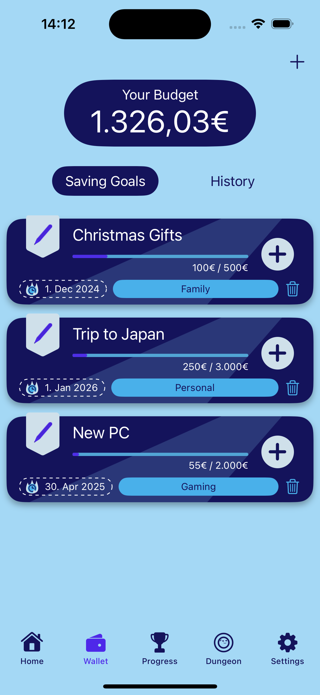
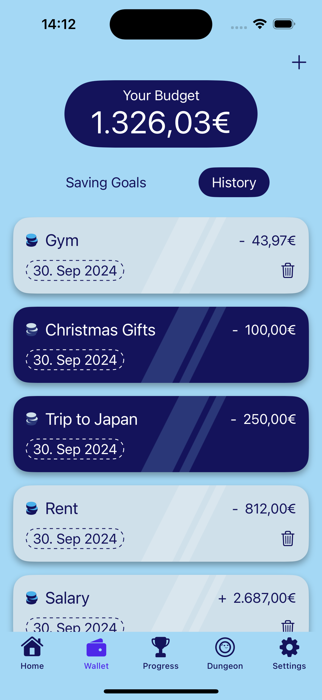
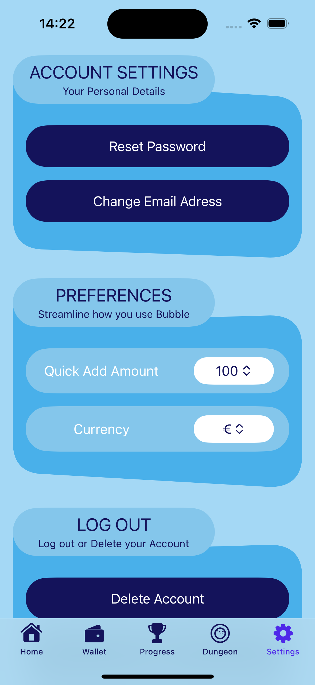

# Bubble

Bubble is for anyone who wants to make managing their money easier. With all the expenses we have nowadays,
it's easy to lose track. On top of that, we also want to set money aside, for example, to go on vacation or 
treat ourselves to a new smartphone. Bubble makes this easier, as users can create and manage savings goals.

## Design

  
  
  

## Features

 - Creating a user profile
 - Creating and maintaining savings goals (e.g. next vacation, new smartphone, etc.)
 - Tracking achieved savings goals
 - Tracking income and expenses

## Technical Structure

#### Project Structure
The project is built following the MVVM architecture. Repositories with the Repository Pattern, Models, Views and Viewmodels.

#### Data Storage
Firebase will be used for data storage.

#### API Calls
https://api-ninjas.com/api/quotes

#### 3rd-Party Frameworks

- Firebase iOS SDK
- FirebaseAuth
- FirebaseFirestore

## Outlook
In the future, I want to integrate a game. Additionally, I want to allow users to link their accounts, enabling them to directly track income and expenses.

## Credit

- Designer & Artist - Tuile (https://tuile.itch.io/)
- Developer - Juuuriii(Juri Huhn)
