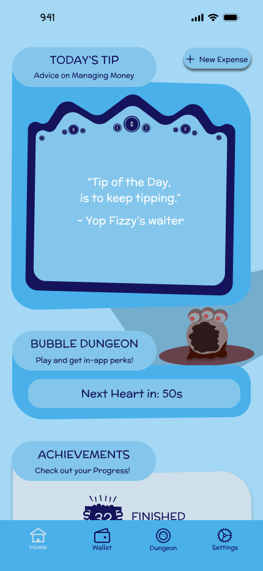
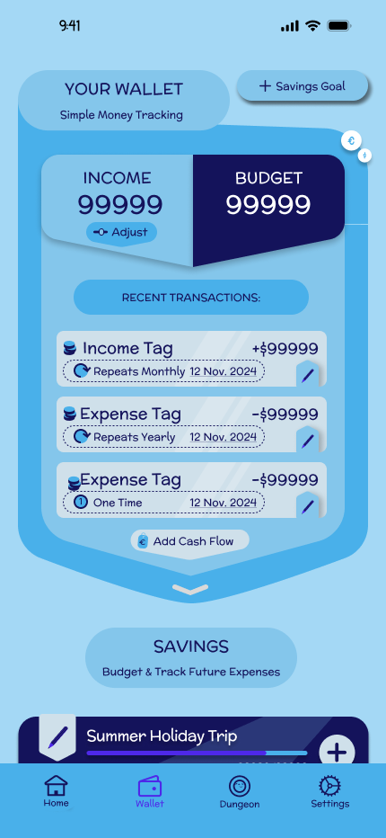
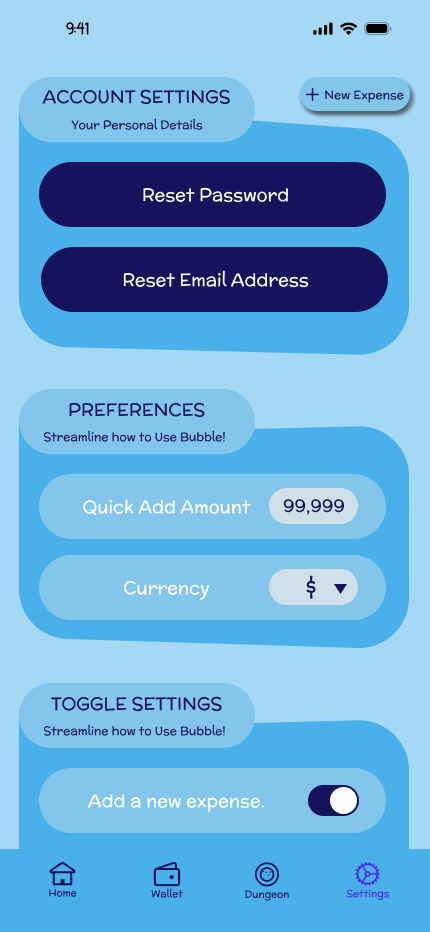

# Bubble

****

Bubble ist für jede Person die ihren Umgang mit Geld erleichtern möchte. Mit all den ausgaben die wir 
heutzutage haben, ist es leicht den Überblick zu verlieren. Dazu kommt noch, dass wir auch Geld beiseite legen
wollen um zum Beispiel in den Urlaub zu fahren oder sich ein neues Smartphone zu gönnen. Dies wird durch Bubble erleichtert,
da der Nutzer Sparziele erstellen und verwalten kann.

## Geplantes Design

  
  
  

## Features
Hier kommen alle geplanten Features der App rein mit dem Status, ob es bereits umgesetzt wurde.

- [Erstellen und Pflegen von Sparzielen(z.B. nächster Urlaub, neues Smartphone usw.)] Feature 1
- [Tracken von Einkommen und Ausgaben] Feature 2
- [Gamification durch ein kleines Spiel in der App. Vorteile für die App durch spielen des Spiels und Vorteile für das Spiel durch nutzung der App]

## Technischer Aufbau

#### Projektaufbau
Das Projekt wird nach der MVVM-Architektur aufgebaut. Ich werde also Repositories, ViewModels, Models und Views anlegen.

#### Datenspeicherung
Für die Datenspeicherung wird Firebase und Core Data genutzt.

#### API Calls
Welche APIs verwendest du?

#### 3rd-Party Frameworks
Bis jetzt wird nur Firebase als 3rd-Party Framework verwendet.

## Ausblick
In Zukunft möchte ich das Spiel ausbauen. Außerdem möchte ich es dem Nutzer ermöglichen seine Konten einzubinden und dann Einkommen und Ausgaben direkt zu tracken.
